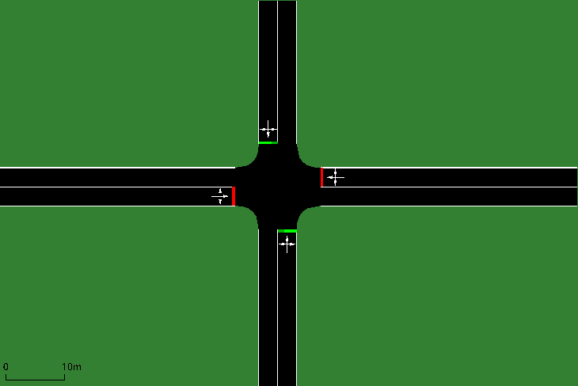
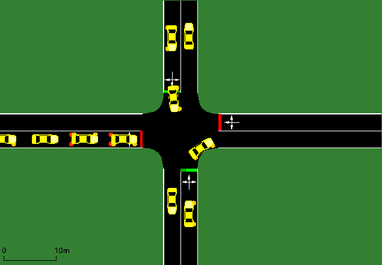

# Dynamic-Traffic-Signal
This repository contains files for the traffic signal system using Reinforcement Learning.

## How to train new Networks.

First Download or clone the repository. 
Then pip install requirements.txt using  

`pip install -r requirements.txt`

you need to download SUMO GUI for running simulations.

download sumo gui from [here](https://sumo.dlr.de/docs/Downloads.php)

### Step1: create network and route file

Use SUMO netedit tool to create a network 
for example 'network.net.xml' and save it in the maps folder.

cd into maps folder and run the following command

`python randomTrips.py -n network.net.xml -r routes.rou.xml -e 500`

This will create a routes.rou.xml file for 500 simulation steps for the network "network.net.xml"

### Map

### Step2: Set Configuration file.

You need to provide network and route files to the Configuration file. 
change net-file and route-files in input.

`<input>`        
  `<net-file value='network.net.xml'/>`
  `<route-files value='route.rou.xml'/>`
`</input>`

### Step3: Train the model.

Now use the train.py file to train a model for this network. 

`python train.py --train -e 50 -m model_name -s 500`

This code will train the model for 50 epochs. 
-e is to set the epochs. 
-m for model_name which will be saved in the model folder. 
-s tells simulation to run for 500 steps. 
--train tells the train.py to train the model if not specified it will load model_name from the model's folder.

At the end of the simulation, it will show time_vs_epoch graphs and save them to plots folder with name time_vs_epoch_{model_name}.png

### Step4: Running trained model.

You can use train.py to run a pre-trained model on GUI.

`python train.py -m model_name -s 500` 

This command will open the SUMO GUI and allow you to see how your model performs. 
Make sure to set the same value for -s during testing and training to get accurate results.

### Simulation of Trained Model

